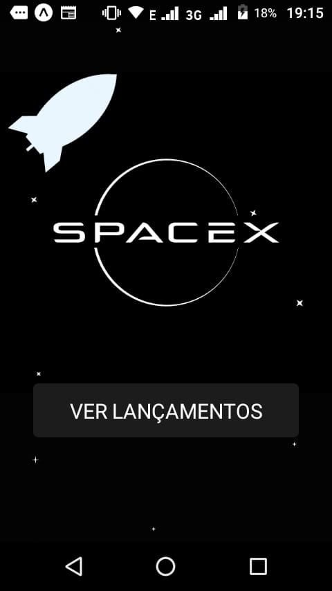
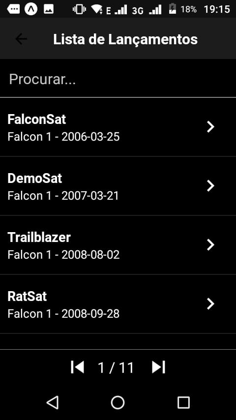
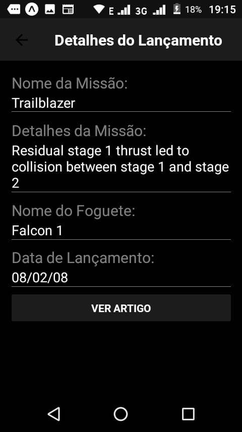
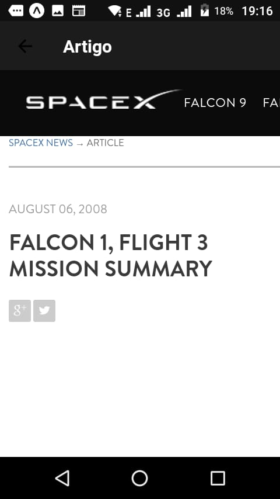

# Launches App

Aplicativo criado para a seleção do estágio da empresa Pontotel. O aplicativo é responsável por mostrar informações e datalhes de lançamentos de foguetes realizados pela empresa SpaceX que podem ser consultadas através do link do projeto da API: https://github.com/r-spacex/SpaceX-API

A Interface Gráfica do aplicativo foi pensanda para seguir a identidade visual proposta pelo site da SpaceX e foi desenvolvida com o auxílio do software AdodeXD.

## Utilização

O aplicativo é bem simples e consiste basicamente em 4 telas diferentes: Uma tela de home, uma tela de pesquisa e listagem dos lançamentos com algumas informações básicas, uma tela para visualizar informações mais detalhadas e mais uma tela para mostrar o artigo referente àquele lançamento. Abaixo print de todas as telas. 







## Instalação

Clone este repositório e execute:

```
npm install
``` 

Depois execute:

```
npm start
```

O aplicativo poderá ser executado no próprio celular utilizando o aplicativo Expo, disponível na Play Store.

